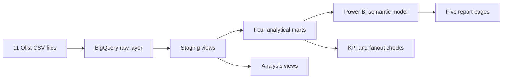

# Olist Marketplace Growth, Seller Onboarding & Fulfilment Analytics

An end-to-end data analytics portfolio project built with **BigQuery SQL** and
**Power BI**. It connects Olist's marketing funnel data to marketplace orders
through `seller_id` to evaluate acquisition quality, seller activation,
commercial performance, fulfilment, and customer experience.

## Business question

> Which acquisition channels produce sellers who close, activate, generate
> strong GMV, and fulfil customer orders reliably?

## Portfolio deliverables

- [Final Power BI report](powerbi/Olist_Marketplace_Analytics_Portfolio.pbix)
- [15-file SQL pipeline](sql/)
- [Raw-data inventory and join audit](docs/data_inventory.md)
- [Automated repository and PBIX checks](tests/test_repository.py)

## Solution architecture



The SQL design deliberately separates raw data, cleaning, analytical marts,
business analysis, and reconciliation checks. Power BI consumes the marts—not
the eleven raw tables directly.

## SQL pipeline

| Stage | Files | Purpose |
|---|---:|---|
| `00_source_profiling` | 2 | Inventory tables, inspect keys, NULLs, and duplicate risks |
| `01_staging` | 4 | Standardise orders, items, payments, and marketing leads |
| `02_marts` | 4 | Build order, order-seller, marketing, and seller-lifecycle marts |
| `03_analysis` | 3 | Analyse acquisition, seller activation, delivery, and reviews |
| `04_quality_checks` | 2 | Reconcile join fanout and final portfolio KPIs |

Important SQL techniques include `JOIN`, CTEs, conditional aggregation,
`COUNTIF`, `CASE`, `SAFE_DIVIDE`, date calculations, string cleaning, window
functions, and explicit grain management.

## Power BI report

The final report contains **five pages and 54 visual objects**:

1. **Executive Overview** — orders, GMV, AOV, active sellers, delivery, and reviews
2. **Acquisition Funnel** — leads, wins, conversion, activation, and channel quality
3. **Seller Performance** — seller GMV, orders, geography, reviews, and fulfilment risk
4. **Fulfilment and CX** — delivery speed, late-delivery rates, freight, and review outcomes
5. **Seller Detail** — seller-level drill-through for performance investigation

The semantic model uses shared `DimDate`, `DimSeller`, and `DimOrigin`
dimensions with one-to-many, single-direction relationships to the analytical
marts.

## Selected validated facts

- 99,441 orders and 112,650 order-item rows
- 8,000 marketing-qualified leads and 842 closed deals
- 380 closed sellers found in marketplace order activity
- Median time from a seller win to first post-win sale: 44 days
- All critical relationships listed in the data inventory achieved 100% match
  coverage, except the intentionally investigated closed-seller activation link

See [the full data inventory](docs/data_inventory.md) for row counts, candidate
keys, duplicate findings, and join coverage.

## Repository structure

```text
olist-marketplace-analytics/
|-- docs/                 # Published data inventory and join audit
|-- powerbi/              # Final PBIX report and reusable theme
|-- scripts/              # Raw-data profiling helper
|-- sql/                  # 15 ordered BigQuery SQL files
|-- tests/                # Repository and PBIX integrity checks
`-- README.md
```

## Reproduce the project

1. Download the [Brazilian E-Commerce Public Dataset by Olist](https://www.kaggle.com/datasets/olistbr/brazilian-ecommerce)
   and place the eleven CSV files under `data/raw/`. Raw data is intentionally
   excluded from GitHub.
2. In BigQuery, create datasets named `olist_raw`, `olist_staging`,
   `olist_marts`, `olist_analysis`, and `olist_quality` in the same location.
3. Upload the CSV files into `olist_raw` using the table names referenced by the
   SQL files.
4. Execute the SQL files in folder and filename order, from
   `00_source_profiling` through `04_quality_checks`.
5. Open `powerbi/Olist_Marketplace_Analytics_Portfolio.pbix`, authenticate the
   BigQuery connection, and refresh the model.
6. Confirm that the quality views report zero failed reconciliation checks.

## Local validation

The checks use Python's standard library only:

```bash
python -m unittest discover -s tests -v
```

They verify the expected SQL structure, final PBIX integrity, report page and
visual counts, embedded theme, and GitHub's 100 MiB single-file limit.

## Data and analytical limitations

- The public dataset covers historical Brazilian marketplace activity and does
  not represent current Olist performance.
- Monetary values are presented in Brazilian reais (`R$`).
- Reviews are recorded at order level. A multi-seller order can therefore
  expose more than one seller to the same review; seller-level review findings
  are associations and must not be presented as causal effects.
- Seller activation is defined as a closed seller appearing in marketplace
  activity on or after `won_date`.
- Raw CSV files are not redistributed in this repository.

## Technology

`Google BigQuery` · `GoogleSQL` · `Power BI` · `DAX` · `Power Query` · `Python`
